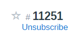
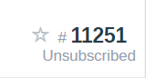
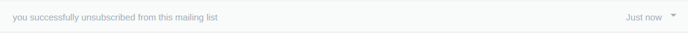

# Add mailing list Unsubscribe functionality

Using the FreeScout SampleModule as the basis, it looks for the unsubscribe headers in new messages
and creates a simple unsubscribe link in the conversation subject bar.

If it can be unsubscribed....  

And once you have clicked on it....  

How it appears in the conversation history....  

If click it makes a POST to the appropriate URL and creates a thread action message with the details.

Still very much a work in progress - looking to support mailto unsubscribe as well. Have been running in production for some time.

Free to use, but if you end up using it in an organisation with 20 or more users, or provide it as part of another package or service, please consider support me via https://ko-fi.com/aarhus and/or helping with the development/maintenance.

Thanks
